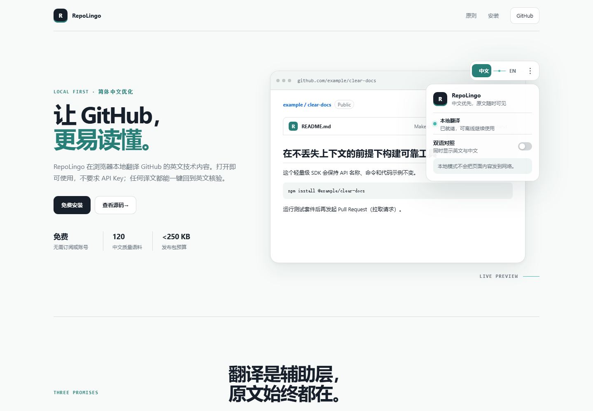

# RepoLingo

> 让 GitHub 更易读懂，同时让英文原文始终触手可及。

[](https://github.com/agilawiegel-ux/repolingo-extension/actions/workflows/ci.yml)
[](https://github.com/agilawiegel-ux/repolingo-extension/releases)
[](LICENSE)

RepoLingo 是一个轻量、中文优先的 Chromium 扩展。它默认使用 Chrome 或 Edge 内置的 Translator API，在设备上把 GitHub 的英文自然语言内容译成简体中文。无需注册、无需 API Key，也不会打包模型、字体或第三方运行时框架。

对复杂技术语义有更高要求的用户，可以主动配置 OpenAI、Gemini 或 DeepSeek。增强翻译默认关闭，不会自动启用，也不会从本地模式静默切换到付费服务。

[English](README.md) · [官网](https://agilawiegel-ux.github.io/repolingo-extension/) · [下载](https://github.com/agilawiegel-ux/repolingo-extension/releases/latest) · [隐私](PRIVACY.zh-CN.md) · [安全](SECURITY.zh-CN.md)



## 项目状态

当前版本是 **v0.1.0 首个公开预览版**，面向桌面 Chrome 138+ 和具备 Translator API 的新版 Edge，正式支持英文到简体中文。

- 扩展可完整本地使用，API 增强只是可选能力。
- 发布包预算：ZIP 不超过 250 KB，解压后不超过 500 KB。
- 当前实测构建：ZIP 约 28 KB，解压后约 62 KB。
- 暂不支持 Firefox、移动浏览器、长期译文缓存和其他目标语言。

提交问题前请先查看[已知限制与路线图](ROADMAP.zh-CN.md)。

## 为什么选择 RepoLingo

- **本地优先**：默认不把 GitHub 页面文本发送给第三方翻译 API。
- **中文优化**：针对 Git、GitHub Actions、AI、前端、容器与常见工程术语进行保护和规范化。
- **一键核验**：原文、译文与双语对照即时切换，不刷新页面，不改变滚动位置。
- **技术内容不动**：代码、命令、URL、路径、版本号、Commit SHA、参数和标识符必须通过完整性校验。
- **异常即回退**：占位符损坏、译文为空或质量门禁失败时保留原文，不展示可疑结果。
- **足够轻**：原生 TypeScript、HTML 和 CSS；没有运行时 UI 依赖、远程字体、遥测、广告或云端账号。

## 安装

RepoLingo 尚未提交 Chrome Web Store 或 Edge Add-ons，目前通过 GitHub Release 安装。

1. 打开 [最新 Release](https://github.com/agilawiegel-ux/repolingo-extension/releases/latest)。
2. 下载 `repolingo-chromium-vX.Y.Z.zip` 和对应的 `.sha256` 文件。
3. 解压 ZIP。
4. 打开 `chrome://extensions` 或 `edge://extensions`。
5. 开启右上角的“开发者模式”。
6. 点击“加载已解压的扩展程序”，选择刚才解压的目录。
7. 访问任意 GitHub 仓库，点击页面右上角的 `中文 ⇄ EN`。

首次翻译时，浏览器可能需要下载并准备语言包。完成后，本地翻译可以离线继续使用。浏览器管理的共享语言包不属于扩展文件，因此不会增加 RepoLingo 安装包体积。

如需校验下载文件：

```powershell
Get-FileHash .\repolingo-chromium-v0.1.0.zip -Algorithm SHA256
```

将结果与 Release 中的 `.sha256` 文件比较即可。

## 使用方法

### 页面右上角悬浮控件

- 点击 `中文`：首次使用时开始翻译；已翻译页面会立即显示中文。
- 点击 `EN`：立即恢复英文原文，不重新加载页面。
- 点击 `···`：展开双语、仓库记忆和翻译方式设置。
- 开启“**双语对照**”：在原文下方显示中文，适合核验技术语义。
- 开启“**记住当前仓库**”：下次进入该仓库时沿用显示方式。

鼠标移到已处理的段落旁边，会出现轻量 `EN/中` 按钮，只切换当前段落。所有控件都支持键盘焦点；按 `Esc` 可以关闭展开面板。

### 扩展弹窗

点击浏览器工具栏中的 RepoLingo 图标，可以：

- 查看当前 GitHub 页面是否已连接；
- 在中文、双语和原文之间切换；
- 开始翻译或恢复英文；
- 进入增强翻译设置。

### 增强翻译（完全可选）

默认情况下不需要打开设置页。只有你主动开启“增强翻译”、选择服务商、填写自己的 API Key 并同意对应域名权限后，RepoLingo 才会向该服务发送经过技术实体保护的自然语言段落。

RepoLingo 不提供代理服务器，不代收费用，也不会自动选择付费接口。第三方 API 的费用、限额与数据处理规则由对应服务商决定。

## 翻译范围

| 页面内容 | v0.1.0 |
| --- | --- |
| README 与仓库简介 | 支持 |
| Issue 标题、正文和评论 | 支持 |
| Pull Request 标题、正文和评论 | 支持 |
| Discussion 标题、正文和回复 | 支持 |
| Release 标题与说明 | 支持 |
| 代码块、行内代码与命令 | 保留原样 |
| Diff、文件树、日志和输入框 | 不翻译 |
| GitHub 按钮和操作控件 | 不翻译 |

## 浏览器兼容性

| 浏览器 | 支持状态 | 说明 |
| --- | --- | --- |
| Chrome 138+（桌面） | 正式支持 | 默认使用浏览器内置 Translator API |
| Edge（桌面） | 正式支持 | 需要浏览器提供 Translator API |
| Firefox | 暂不支持 | v1 不提供兼容实现 |
| 移动浏览器 | 暂不支持 | 当前交互针对桌面 GitHub |

如果界面显示“本地翻译不可用”，请先更新浏览器并重新打开 GitHub 页面。RepoLingo 不会在本地引擎不可用时自动调用付费接口。

## 翻译与安全流水线

```text
识别页面类型 → 建立语义段落 → 锁定技术实体 → 翻译
            → 校验占位符 → 中文规范化 → 安全渲染
```

原始 DOM 始终保留。译文通过 `textContent` 和受控文本节点写入，不执行模型输出，也不注入 HTML。GitHub 动态导航后，旧任务会取消并重新扫描；译文仅存在于当前页面内存。

API Key 只保存在扩展受信任的本地存储中，GitHub 页面和内容脚本无法读取。完整说明见[隐私政策](PRIVACY.zh-CN.md)和[安全政策](SECURITY.zh-CN.md)。

## 从源码构建

要求 Node.js 20 或更高版本，推荐 Node.js 22。

```bash
git clone https://github.com/agilawiegel-ux/repolingo-extension.git
cd repolingo-extension
npm ci
npm run verify
```

- `dist/`：可通过浏览器“加载已解压的扩展程序”直接加载。
- `release/`：ZIP 与 SHA-256 发布文件。
- `docs/`：无框架 GitHub Pages 官网。
- `quality/corpus.json`：120 条人工审核参考语料。

常用命令：

| 命令 | 用途 |
| --- | --- |
| `npm run typecheck` | TypeScript 类型检查 |
| `npm test` | 单元与 DOM 场景测试 |
| `npm run build` | 构建扩展到 `dist/` |
| `npm run pack` | 生成 ZIP 与 SHA-256 |
| `npm run size` | 检查发布体积预算 |
| `npm run verify` | 执行完整发布门禁 |

## 质量门禁

- 120 条参考语料覆盖 README、Issue、PR、Discussion 和 Release。
- 测试覆盖术语保护、占位符恢复、中文规范化、页面分类和三家服务响应解析。
- CI 检查密钥泄漏、远程脚本、危险执行、Manifest 完整性和构建入口。
- GitHub Actions 对发布 ZIP 与解压体积执行硬性限制。
- 自然语言翻译无法保证绝对零误译；RepoLingo 保证译文可核验、技术实体受保护、异常结果不强行显示。

## 参与项目

- 使用问题与排查：[支持说明](SUPPORT.zh-CN.md)
- 功能建议与 Bug：[Issues](https://github.com/agilawiegel-ux/repolingo-extension/issues)
- 开发计划：[Roadmap](ROADMAP.zh-CN.md)
- 贡献代码或语料：[贡献指南](CONTRIBUTING.zh-CN.md)
- 社区协作规范：[行为准则](CODE_OF_CONDUCT.zh-CN.md)
- 安全漏洞：请使用仓库的私密漏洞报告，不要创建公开 Issue。

## 许可证

RepoLingo 使用 [MIT License](LICENSE)。
